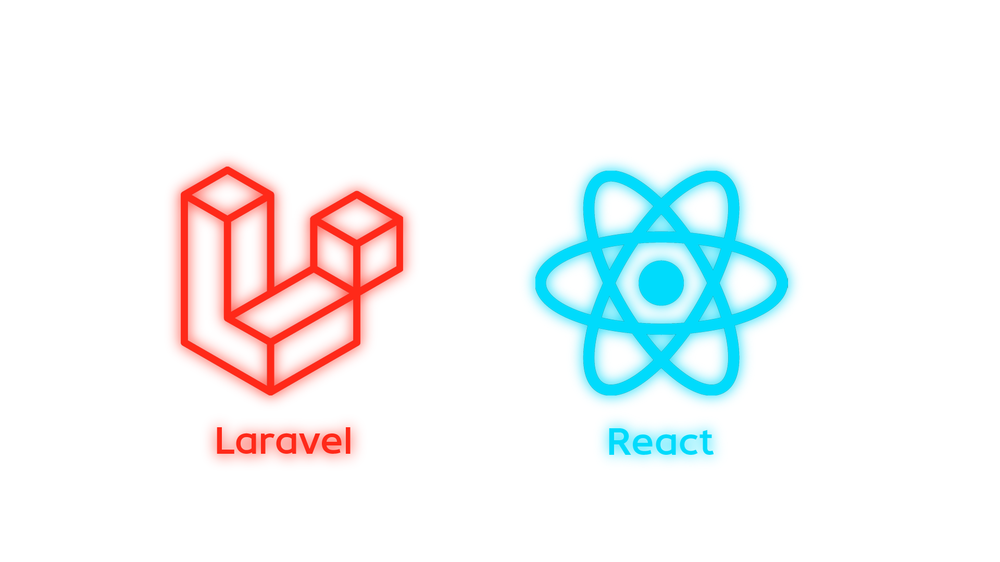

# Laravel структура коммерческого Enterprise-проекта

Бесплатная структура коммерческого Laravel проекта на базе `React`.

## Архитектура

Вся front-end разработка будет вестись в папке `resources/js`  
Вся API-разработка в `app/Http/Controllers/API/V1` - Enterprise-конвенция  
Вся логика расположена в `app/Services` - конвенция Laravel

## Установка в 5 шагов

`git clone git@github.com:wemmbley/react-laravel-structure.git` [Скачать бесплатно GIT на ПК](https://git-scm.com/install/)

`composer install` [Скачать композер на ПК бесплатно](https://getcomposer.org/download/)

`php artisan serve` [Скачать PHP если отсутствует на ПК](https://www.php.net/downloads.php)

`npm i` [Скачать node.js на ПК бесплатно](https://nodejs.org/en/download)

`npm run dev`

## Бесплатная база знаний

[Мой ютуб канал с бесплатными знаниями по IT](https://www.youtube.com/@RustamProIT/videos)  
[Мой сайт с авторскими статьями тем кто хочет глубже разобраться в Laravel](https://rustam.astre.ws/)  
[Плейлист с Enterprise-Архитектурой на Laravel для новичков](https://www.youtube.com/watch?v=Bbz7NnhWou8&list=PLFQy1WSCvUO_juLt1tz1VwF0u8fZ3Fxfj&index=1)  
[React за 27 минут для новичков](https://www.youtube.com/watch?v=T3LAHIyPmlw&list=PLFQy1WSCvUO9dSOdly1QVNQqZymqVY6Ao)
